# X-Lab硬件部第一次内训作业（线性代数计算库的实现）
姓名：何辰阳     学号：3240104411  

---

## 1. 作业背景与说明  


### 1.1 作业内容  

本次作业旨在用C语言实现一个实现一个线性代数计算库，来辅助我们进行运算。考察了基础的数学能力、通过编程解决问题的能力以及工程管理、CMake、git等综合能力。作业在编程部分需完成以下内容：  

> 1. 根据`inc/algebra.h`中的注释和预定义，在`src/algebra.c`中实现对应的函数。
> 2. 自行编写`CMakeLists.txt`文件，使工程能够在本地成功编译运行。
> 3. 修改`README.md`文件，需要包含实现思路以及本地运行截图。

### 1.2 输入与输出
本题目采用帧判定的思路进行：

每一帧的第一行指令代码，`+`、`-`、`*`、`.`、`t`、`d`、`i`、`r`、`j`分别测试`add_matrix`（加法运算）、`sub_matrix`（减法运算）、`mul_matrix`（乘法运算）、`scale_matrix`（数乘运算）、`transpose_matrix`（转置运算）、`det_matrix`（行列式求解）、`inv_matrix`（矩阵的逆运算）、`rank_matrix`（矩阵求秩）、`trace_matrix`（矩阵求迹）函数，`q`表示退出。

接下来的一行输入矩阵 $\mathbf{A}$ 的行数 $m$ 和列数 $n$ ，在接下来的 $m$ 行中输入 $n$ 个双精度浮点数，以空格分开。
对于二元运算函数的测试，需要再按照上述过程输入矩阵 $\textbf{B}$ 。  

在每一帧中，依次根据输入的指令代码运行对应的函数，并给出函数的输出与标准值比对。 

---

## 2. algebra.c的函数思路简介、代码实现、输出示例  


### 2.1 加法的实现  

#### 2.1.1 思路简介  

矩阵的加法运算较为简单，将两个行数、列数均相同的存在于` Matrix`结构中的矩阵（以一个二维数组的形式储存）每个对应位置的数对应相加产生一个新矩阵并输出即可。另外，若两个矩阵的行数或列数不相等，则无法进行矩阵的加法运算，会报错并输出一个空矩阵。

#### 2.1.2 代码实现  

``````c
Matrix add_matrix(Matrix a, Matrix b)
{
    if (a.rows!=b.rows || a.cols!=b.cols) {
        printf("Error: Matrix a and b must have the same rows and cols.\n");
        Matrix c=create_matrix(0,0);
        return c;
    }
    /*
    判断两个矩阵的行数、列数是否相等，若行数或列数不相等则报错
    */
    else{
        Matrix c=create_matrix(a.rows,a.cols);
        for (int i=0;i<c.rows;i++) {
            for (int j=0;j<c.cols;j++) {
                c.data[i][j]=a.data[i][j]+b.data[i][j];
            }
        }
        return c;    
    }
    /*
    两个矩阵每个对应位置的数对应相加产生一个新矩阵并输出
    */
    
}
``````

#### 2.1.3 输出示例  

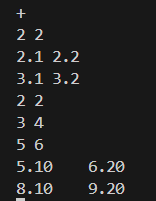     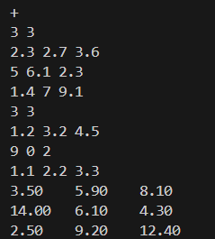    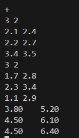    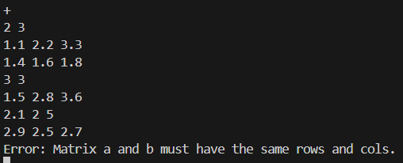  


### 2.2 减法的实现  

#### 2.2.1 思路简介  

矩阵的减法运算与加法运算类似，将两个行数、列数均相同的存在于` Matrix`结构中的矩阵（以一个二维数组的形式储存）每个对应位置的数对应相减产生一个新矩阵并输出即可。另外，若两个矩阵的行数或列数不相等，则无法进行矩阵的减法运算，会报错并输出一个空矩阵。

#### 2.2.2 代码实现  

``````C
Matrix sub_matrix(Matrix a, Matrix b)
{
    if (a.rows!=b.rows || a.cols!=b.cols) {
        printf("Error: Matrix a and b must have the same rows and cols.\n");
        Matrix c=create_matrix(0,0);
        return c;
    }
    /*
    判断两个矩阵的行数、列数是否相等，若行数或列数不相等则报错
    */
    else{
        Matrix c=create_matrix(a.rows,a.cols);
        for (int i=0;i<c.rows;i++) {
            for (int j=0;j<c.cols;j++) {
                c.data[i][j]=a.data[i][j]-b.data[i][j];
            }
        }
        return c;    
    }
    /*
    两个矩阵每个对应位置的数对应相加产生一个新矩阵并输出
    */
}
``````

#### 2.2.3 输出示例  

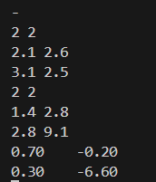    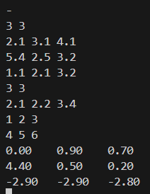    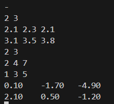  

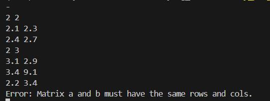  


### 2.3 乘法的实现  

#### 2.3.1 思路简介  

存在于` Matrix`结构中的一个矩阵（以一个二维数组的形式储存）与另一个存在于`Matrix`结构中的矩阵相乘，要求第一个矩阵的列数与第二个矩阵的行数相同，设第一个矩阵为m $\times$ n的矩阵A，第二个矩阵为n $ \times$ p的矩阵B，则乘法运算的结果为一个m$\times$p的矩阵C，其中$c_{ij}$的计算法则如下：  
$$
c_{ij}=\sum^{n}_{k=1}a_{ik}b_{kj}
$$
若第一个矩阵的列数与第二个矩阵的行数不相等，无法进行矩阵的乘法运算，则报错。  

#### 2.3.2 代码实现  

``````c
Matrix mul_matrix(Matrix a, Matrix b)
{
    if (a.cols!=b.rows) {
        printf("Error: The number of cols of matrix a must be equal to the number of rows of matrix b.\n");
        Matrix c=create_matrix(0,0);
        return c;
    }
    /*
    若第一个矩阵的列数与第二个矩阵的行数不相等，无法进行矩阵的乘法运算，报错
    */
    else{
        Matrix c=create_matrix(a.rows,b.cols);
        for (int i=0;i<c.rows;i++) {
            for (int j=0;j<c.cols;j++) {
                double c_num=0.0;
                for (int k=0;k<a.cols;k++) {
                    c_num +=a.data[i][k]*b.data[k][j];
                }
            c.data[i][j] = c_num;
            }
        }
        return c;
    }
    /*
    生成一个m*p的矩阵C，每个元素遍历求解
    */
}
``````

#### 2.3.3 输出示例  

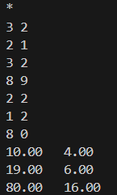    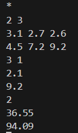    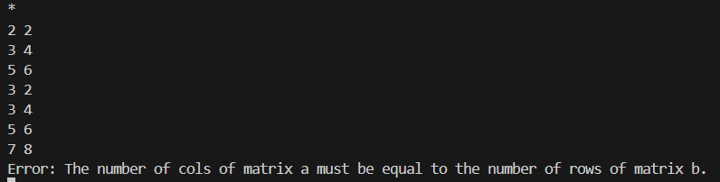


### 2.4 数乘的实现  

#### 2.4.1 思路简介  

矩阵的数乘运算即将一个常数与一个矩阵相乘。得到的结果矩阵中每个元素与原矩阵元素一一对应，元素的值为原矩阵元素的值乘所给常数。

#### 2.4.2 代码实现  

``````c
Matrix scale_matrix(Matrix a, double k)//main.c中，k为常数2
{
    Matrix c=create_matrix(a.rows,a.cols);
    for (int i=0;i<c.rows;i++) {
        for (int j=0;j<c.cols;j++) {
            c.data[i][j]=a.data[i][j]*k;
        }
    }
    return c;
}
/*
每个元素依次遍历乘k
*/
``````

#### 2.4.3 输出示例  

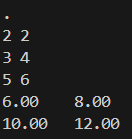    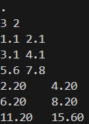  


### 2.5 转置的实现  

#### 2.5.1 思路简介  

矩阵的转置即将m$ \times$n的矩阵A转换成n$ \times$m的矩阵B，其中A和B的元素对应关系为：
$$
a_{ij}=b_{ji}
$$

#### 2.5.2 代码实现  

``````c
Matrix transpose_matrix(Matrix a)
{
    Matrix c=create_matrix(a.cols,a.rows);
    for (int i=0;i<a.rows;i++) {
        for (int j=0;j<a.cols;j++) {
            c.data[j][i]=a.data[i][j];
        }
    }
    return c;
}
``````

#### 2.5.3输出示例  

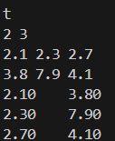    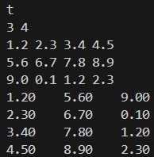


### 2.6 行列式求解的实现  

#### 2.6.1 思路简介  

行列式的求解可以用按列展开的方法进行。将一列中每个元素$a_{ij}$与其代数余子式相乘，即可将n阶行列式化为（n-1）阶行列式相加，具体思路如下述数学表达所示：
$$
C_{ij}=(-1)^{i+j}\,M_{ij}\\

    \det(A)=\sum_{i=1}^{n} a_{ij}\,C_{ij}
    =\sum_{i=1}^{n} a_{ij}(-1)^{i+j}M_{ij}.
$$
在后续代码中，我将始终以第一列展开，逐步将行列式降阶求解。同时，行列式需是方阵，若矩阵的行数与列数不相等，则不能进行行列式求解，会报错。

在代码实现中，可以采用递归的思想对方阵进行不断的降阶。

#### 2.6.2 代码实现  

``````c
double det_matrix(Matrix a)
{
    if (a.rows!=a.cols) {
        printf("Error: The matrix must be a square matrix.\n");
        return 0.0;
    }
    /*
    行数与列数不相等，则无法进行行列式求解，报错
    */
    else if(a.rows==1&&a.cols==1){
        return a.data[0][0];
    }//递归的终点为一维方阵
    else{
        double sum=0.0;
        double pn_num=1.0;
        for (int i=0;i<a.rows;i++){
            Matrix c=create_matrix(a.rows-1,a.cols-1);
            for(int j=0;j<a.rows;j++){
                if(i==j)continue;
                for(int k=1;k<a.cols;k++){
                    if(j<i){
                        c.data[j][k-1]=a.data[j][k];
                    }
                    else{
                        c.data[j-1][k-1]=a.data[j][k];
                    }
                }
            }
            //求第一列某元素对应的余子式
            double row_num=0.0;
            row_num=a.data[i][0]*pn_num*det_matrix(c);
            //元素乘自己的代数余子式为按列展开的一项
            for (int i = 0; i < c.rows; i++) {
                free(c.data[i]);
            }//释放存储空间，防止在高维情况下出错
            free(c.data);
            sum+=row_num;
            pn_num=-pn_num;
        }
        //按第一列的每个元素一一遍历
        return sum;
    }
}
``````

#### 2.6.3 输出示例  

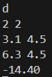    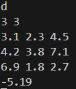    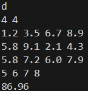    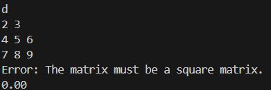  


### 2.7 矩阵求逆的实现  

#### 2.7.1 思路简介  

对于一个 $n\times n$ 的方阵 A（$$|\textbf{A}|\neq 0$$），可以根据伴随矩阵来求逆，即

$$
\textbf{A}^{-1}=\dfrac{1}{|\textbf{A}|}\textbf{A}^*
$$
其中 $\textbf{A}^*$ 是A的伴随矩阵，其计算方法为
$$
a^*_{ij}=(-1)^{i+j}|\textbf{A}_{ji}|
$$
 $\textbf{A}_{ji}$ 表示矩阵 $\textbf{A}$ 将第 $j$ 行和第 $i$ 列删除后得到的子矩阵。若$$|\textbf{A}|= 0$$或矩阵不为方阵，则不能求逆，报错。

#### 2.7.2 代码实现  

``````c
Matrix inv_matrix(Matrix a)
{
    if(a.rows != a.cols){
        printf("Error: The matrix must be a square matrix.\n");
        Matrix c=create_matrix(0,0);
        return c;
    }//若不是方阵则不能求逆
    double det=det_matrix(a);
    if(det==0.0){
        printf("Error: The matrix is singular.\n");
        Matrix c=create_matrix(0, 0);
        return c;
    }//若行列式为0，则逆矩阵不存在
    Matrix bs=create_matrix(a.rows, a.cols);//初始化伴随矩阵
    for(int i=0;i<a.rows;i++){
        for(int j=0;j<a.cols;j++){
            Matrix m=create_matrix(a.rows-1, a.cols-1);
            for(int r=0;r<a.rows;r++){
                if (r==j) continue;
                int row_in_m =r<j ? r:r-1;
                for(int c=0;c<a.cols;c++){
                    if(c==i)continue;
                    int col_in_m=c<i ? c:c-1;
                    m.data[row_in_m][col_in_m]=a.data[r][c];
                }
            }
            /*
            遍历矩阵的每个元素，计算对应的代数余子式
            */
            double mdet=det_matrix(m);
            bs.data[i][j]=((i+j)%2==0 ? 1:-1) * mdet;
        }
    }
    Matrix inv=create_matrix(a.rows,a.cols);
    for (int i=0;i<a.rows;i++) {
        for (int j=0;j<a.cols;j++) {
            inv.data[j][i]=bs.data[i][j] / det; 
        }
    }
    /*
    转置伴随矩阵并除以行列式，得到逆矩阵
    */
    return inv;
}
``````

#### 2.7.3 输出示例  

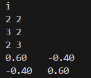    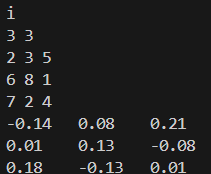    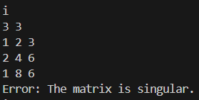    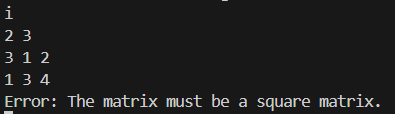


### 2.8 矩阵求秩的实现  

#### 2.8.1 思路简介  

本算法利用高斯消元法将矩阵通过一系列行变换化为行阶梯形形式，从而统计非零行的数量作为矩阵的秩。  

#### 2.8.2 代码实现  

``````c
int rank_matrix(Matrix a){
    Matrix c=create_matrix(a.rows,a.cols);
    for(int i=0;i<a.rows;i++) {
        for(int j=0;j<a.cols;j++) {
            c.data[i][j]=a.data[i][j];
        }
    }  
    int row=0;// row 记录当前已处理的主元行数（秩计数）    
    /*
    对每一列执行高斯‑乔丹消元，直到行或列耗尽
    */ 
    for (int ii = 0; ii < a.cols && row < a.rows; ii++) {  
        // 在第 ii 列中，从第 row 行往下选取绝对值最大的主元行 Num  
        int Num=row;
        for(int jj=row+1;jj<a.rows;jj++) {
            if(fabs(c.data[jj][ii])>fabs(c.data[Num][ii])) Num=jj;
        } 
        if(fabs(c.data[Num][ii])==0)continue;// 若该列所有元素均为 0，则跳过此列  
        if(Num!=row){
            for(int z=0;z<a.cols;z++){
                double t=c.data[row][z];
                c.data[row][z]=c.data[Num][z];
                c.data[Num][z]=t;
            }
        }// 若主元不在当前这一列行，则交换两行  
        double xx=c.data[row][ii];
        for(int k=ii;k<a.cols;k++)c.data[row][k]/=xx;  //主元归一化
        for(int kk=0;kk<a.rows;kk++){
            if(kk!=row){
                double mul=c.data[kk][ii];
                for(int j=ii;j<a.cols;j++){
                    c.data[kk][j]-=mul*c.data[row][j];
                }
            }
        }//高斯消元
        row++;  
     }
     int rank=row;
     for (int i = 0; i < c.rows; i++) {
         free(c.data[i]);
     }
     free(c.data);
     return rank; 
}
``````

#### 2.8.3 输出示例  

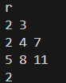    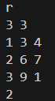    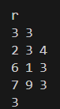    


### 2.9 矩阵求迹的实现  

#### 2.9.1 思路简介  

主对角线上的元素相加即为矩阵的秩。

#### 2.9.2 代码实现  

``````c
double trace_matrix(Matrix a)
{
    if (a.rows !=a.cols) {
        printf("Error: The matrix must be a square matrix.\n");
        return 0.0;
    }
    double sum=0.0;
    for (int i=0;i<a.rows;i++) {
        sum+=a.data[i][i];
    }
    return sum;
}
``````

#### 2.9.3 输出示例  

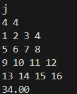    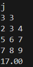    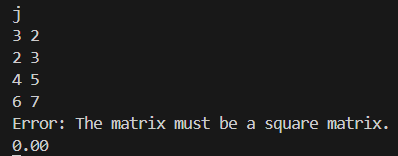    

---

## __第一次内训作业终于写完了！__ :tada::tada::tada:
